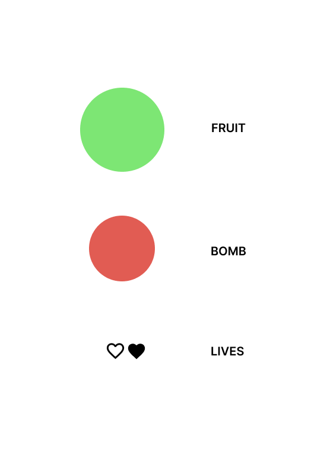

# Fruit_Ninja

## **_Date: 11/28/2023_**

### **_By: Dalia Ahmed_**

***

### **_Description_**

A game where the player will slash fruit as they apears on screen. Player's score will update based on how many fruit they are able to slash. The game ends when lives run out or when player hits a bomb instead of fruit.

***

### **_Technologies Used_**

- HTML
- CSS
- Javascript

***

### **_Getting Started_**

1. Set up pseudo code for step by step game play and functiontionality
2. wireframe user interface of game
3. Add html and css elements needed to start game
4. Add functionality in javascript

***

[Pseudo code](./pseudo/pseudo.txt)

***

### **_Wireframes_**

#### Game Start

#### Game Play

#### Game Over

#### Assets

***

### **_Credits_**

[animation pop][https://css-tricks.com/playing-with-particles-using-the-web-animations-api/#aa-step-4-animate-each-particle]